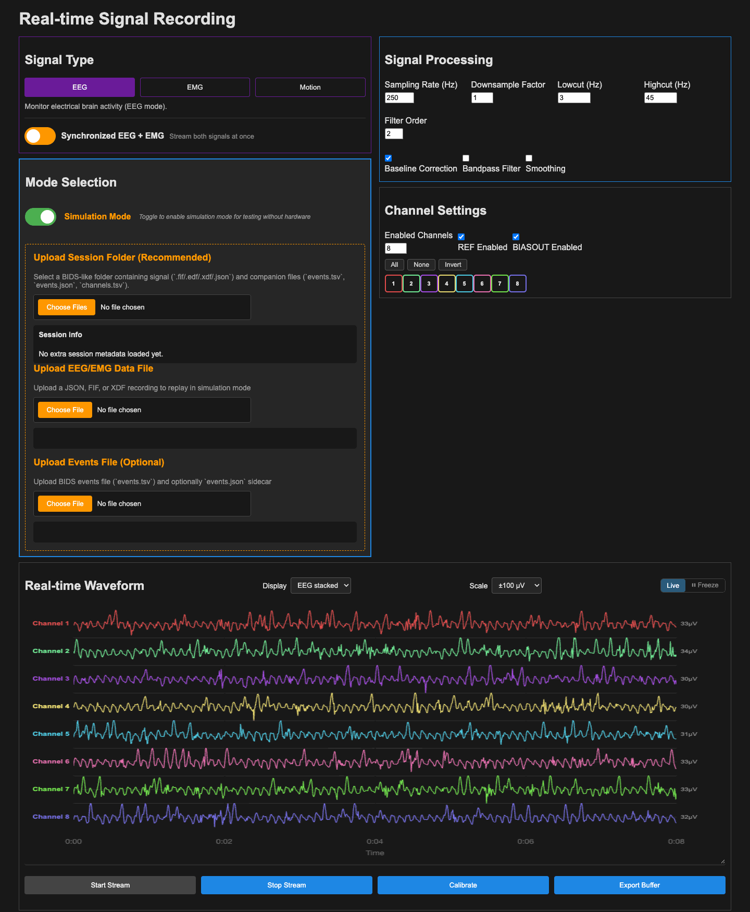

<div align="center">
    
    
    
</div>

# N-Pulse Visual Interface

Record, replay and visualise **EEG / EMG** signals in real time, in the browser, and save them as [BIDS](https://bids.neuroimaging.io/) for the decoding pipeline.



## Sources

| Source | Signal | Needs | Status |
|---|---|---|---|
| Simulation | EEG · EMG · Motion | nothing | ✅ |
| File replay | `.json` `.edf` `.fif` `.xdf` | a recording | ✅ `.json` `.edf` · ❔ `.fif` `.xdf` |
| **EMG bracelet** | EMG · 6 channels · 500 Hz | Arduino UNO R4 with the Chords firmware, over USB | ✅ |
| DSI-24 headset | EEG | the DSI-to-LSL bridge running | ⚠️ untested · [not selectable in the page](docs/USER_GUIDE.md#dsi-24-headset-via-lsl) |
| PiEEG | EEG | Raspberry Pi with the PiEEG shield | ❔ not verified |

## Quick start

```bash
git clone https://github.com/N-Pulse/BMI-SOFT-Data_Visualization.git
cd BMI-SOFT-Data_Visualization/visual_interface
./run_local.sh
```

Open **http://127.0.0.1:5001**, switch on **Simulation Mode**, press **Start Stream**.

The script creates a virtual environment, installs the dependencies and starts the server. Start it this way and not with `flask run`: the Socket.IO server has to be launched through `app.py`. No bash (Windows)? See [manual setup](docs/USER_GUIDE.md#manual-setup).

> **Needs internet.** The page loads Chart.js and Socket.IO from CDNs; offline it opens but draws nothing and shows no error. Python 3.10+, tested on 3.14.

## What's where

| Path | What it is |
|---|---|
| [`visual_interface/app.py`](visual_interface/app.py) | The whole backend: acquisition, filtering, recording, BIDS export |
| [`visual_interface/templates/`](visual_interface/templates) · [`static/`](visual_interface/static) | The web page |
| [`visual_interface/tests/`](visual_interface/tests) | Tests for the recording path |
| [`visual_interface/scripts/`](visual_interface/scripts) | Sample-data generators |
| [`docs/USER_GUIDE.md`](docs/USER_GUIDE.md) | Using the interface, hardware setup, troubleshooting |
| [`docs/ARCHITECTURE.md`](docs/ARCHITECTURE.md) | How it works, adding a source, **known limitations** |

## Contributing

Work on a branch and open a pull request; the template asks what changed and where the docs live. Read the [known limitations](docs/ARCHITECTURE.md#known-limitations) first: they are the to-do list.
