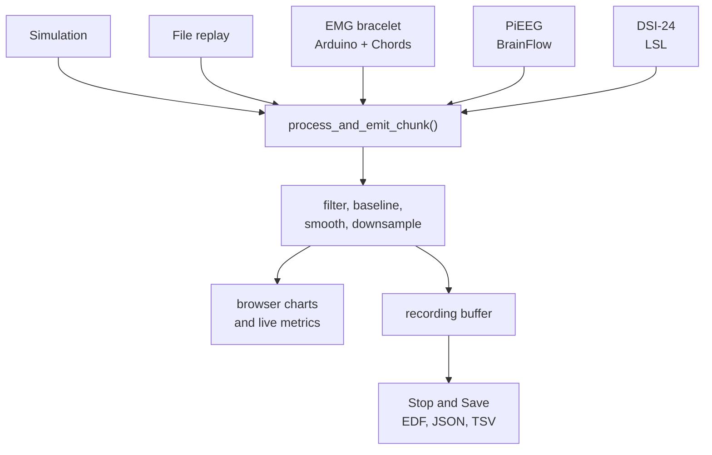

# Architecture

How the interface works, where to change things, and what is still missing. Function names are the landmarks in [`app.py`](../visual_interface/app.py); line numbers drift, so search for the name.

## Data flow



Every source ends in the same function, `process_and_emit_chunk()`. Upstream is only *how a `(channels × samples)` array gets produced*; downstream is display and saving.

> The recording buffer is fed **after** the processing chain, so saved files hold processed data. `describe_software_filters()` writes what was applied into the sidecar.

## Where to change what

| I want to… | Look at (`visual_interface/`) |
|---|---|
| Add a hardware source | a new `read_*()` in `app.py`, `/start-analysis`, a control in `templates/index.html` — [recipe](#add-a-hardware-source) |
| Change the filters | `apply_filters()` · `update_filter_coefficients()` · the `lowcut` / `highcut` defaults at the top of `app.py` |
| Change what is saved | `create_bids_edf()` · `save_bids_recording()` · `get_default_metadata_fields()` |
| Change markers and events | `/add-marker` · `/end-marker` · `create_events_tsv()` |
| Change the page | `templates/index.html` · `static/js/app.js` (charts, controls) · `static/styles.css` |

The acquisition threads, started as Socket.IO background tasks from `/start-analysis`, which picks one from the mode switch, the signal type and `hardware_source`:

| Function | Source |
|---|---|
| `read_eeg_data_simulation()` · `read_emg_data_simulation()` · `read_motion_data_simulation()` | synthetic signals |
| `read_eeg_data_file_simulation()` | replay of an uploaded file |
| `read_emg_data_chords_serial()` | **EMG bracelet** (`…_dual()` for the second stream in dual mode) |
| `read_eeg_data_brainflow()` | PiEEG through BrainFlow |
| `read_eeg_data_lsl()` | DSI-24 through LSL |

## Add a hardware source

1. Write `read_<source>()` next to the others: loop while `running`, build a `(channels × samples)` array and call `process_and_emit_chunk(chunk, rate, acquisition_ts=time.time(), signal_type='emg')`. Copy `read_emg_data_chords_serial()`; it shows the serial pattern.
2. Import the driver **inside** the function, so the app still starts in Simulation mode on a laptop without the hardware libraries.
3. Register it in `/start-analysis`.
4. Add the control to `templates/index.html` and call the matching route from `static/js/app.js`.
5. Put configuration in environment variables with defaults (like `EMG_SERIAL_PORT`), never a hard-coded device path.

## What Decoding needs from the recordings

- **Labels with onset and duration.** `/add-marker`, then `/end-marker`. An unclosed marker is written as `n/a`, never as a fake `0`.
- **The same channel order and electrode placement every session, written down** in Edit Metadata. Electrode shift between days is the main reason a decoder that scored well fails on another day.
- **Several sessions on different days**, not one long session.
- **Read `SoftwareFilters` in the sidecar before training.** The saved data is already processed.

## Known limitations

Ranked by how much they matter for next year's recordings. This is the to-do list.

| # | Problem | Why it matters | Fix |
|---|---|---|---|
| 1 | The page loads Chart.js (**unpinned**) and Socket.IO 4.0.0 from CDNs | With no internet (restricted hospital Wi-Fi, for example) the page opens but draws nothing and shows no error; a new Chart.js release could also change behaviour | Download both into `static/vendor/` and load them with `url_for('static', …)` |
| 2 | No control selects the hardware source; the page never calls `/set-hardware-source` | The DSI-24 cannot be started from the browser | Add a `pieeg` / `dsi_lsl` dropdown |
| 3 | Bracelet samples are raw ADC counts (zero-centred), labelled µV | Units in the charts, `channels.tsv` and the EDF are wrong; amplitudes are not comparable across devices | Get the analogue gain from the EMG team, then convert or label the units `a.u.` |
| 4 | The page cannot give a marker a duration, and there is no cued protocol | Decoding cannot cut training windows exactly; labels carry the operator's reaction time | A protocol runner that calls `/add-marker` and `/end-marker` on a timer. **Build this first** |
| 5 | Metadata defaults still describe the PiEEG (*Manufacturer*, *Model*, *Communication Protocol*, *Institution*); `TaskDescription` and the `Filter*` rows are static | Bracelet sidecars name the wrong device unless edited each time; `FilterHighPass`, `FilterLowPass` and `FilterOrder` appear even with the bandpass off, so trust `SoftwareFilters` | Bracelet-aware defaults (needs the official device names from the EMG team) |
| 6 | Filter defaults are EEG-shaped, 3–45 Hz | Would remove most EMG power if enabled for EMG. The useful band is roughly 20–450 Hz, and at 500 Hz sampling only frequencies below 250 Hz are usable | Per-signal presets, clamped to the Nyquist frequency |
| 7 | Filtering runs on each ~100 ms chunk with `filtfilt` and carries no state | Edge transients at every chunk boundary; not the same as filtering the continuous signal | `scipy.signal.sosfilt` with retained `zi` |
| 8 | Only processed data is saved, and `SoftwareFilters` reflects the settings at *save* time | Nothing can be re-filtered later; changing settings mid-recording misdescribes the file | Save raw data in parallel; snapshot the settings at start |
| 9 | The tests cover the recording path only | Serial parsing, replay and the frontend are untested | Add a serial test, for example a pseudo-terminal that streams Chords packets |

## Tests

```bash
cd visual_interface
source ../.venv/bin/activate       # created by run_local.sh
python tests/test_recording.py     # no pytest needed
```

They check marker durations, the BIDS sidecar, `dataset_description.json`, and that a sidecar cannot contradict the file it describes.

## Last verified

29 Sep 2026 on macOS with Python 3.14.

- ✅ simulation · dual stream · file replay (`.json`, and the app's own `.edf` and session folders) · recording → BIDS → replay
- ✅ the bracelet path, against a simulated Arduino on a pseudo-terminal; Tim tried the real bracelet
- ❔ not verified: PiEEG, DSI-24, `.fif` / `.xdf` replay, Windows
