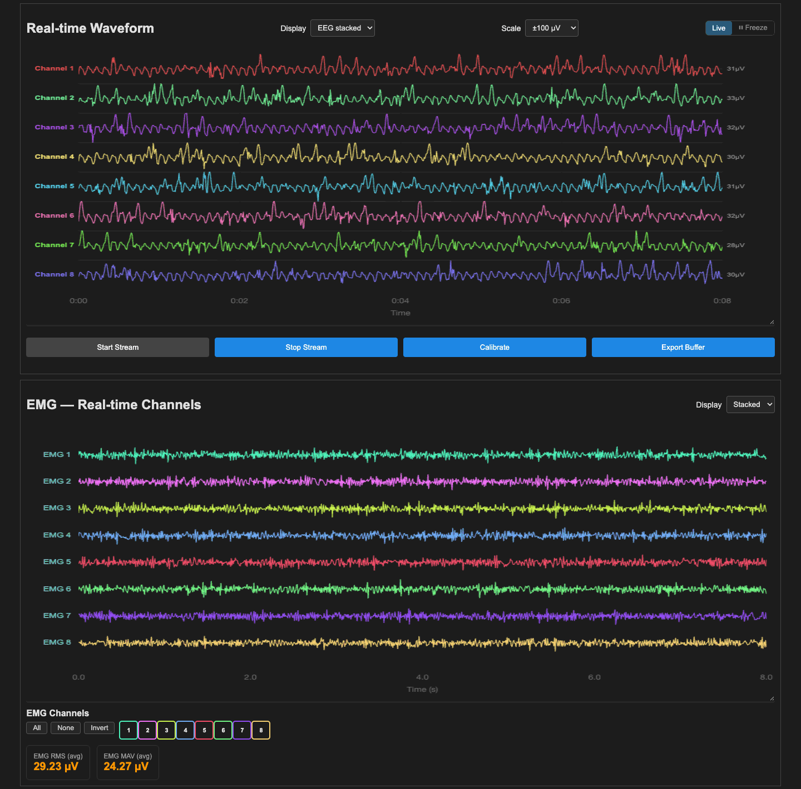

# User guide

How to use the interface once it is running. To start it, see the [Quick start](../README.md#quick-start).

## Pick a source

| I want to… | Signal | Mode switch | Also |
|---|---|---|---|
| Try the interface | EEG · EMG · Motion | **Simulation** | – |
| Replay a recording | any | **Simulation** | upload a session folder or a file |
| Record from the **EMG bracelet** | **EMG** | **Hardware** | Arduino plugged in, *Enabled Channels* = 6 |
| Record EEG from a PiEEG board | EEG | **Hardware** | Raspberry Pi with the PiEEG shield |
| Show EEG and EMG together | EEG + **Synchronized EEG + EMG** | either | [see below](#eeg-and-emg-together) |

The DSI-24 headset is not in the table because the page cannot select it yet: see [DSI-24](#dsi-24-headset-via-lsl).

**No recording at hand?** `python scripts/generate_sample_eeg.py` (or `generate_sample_emg.py`) writes a sample `.json` into the folder you run it from. Upload it to try file replay.

**Replaying:** *Upload Session Folder* is the easy way, since it picks up the signal, `events.tsv`, `events.json` and `channels.tsv` on its own. The alternative is *Upload EEG/EMG Data File*, optionally with *Upload Events File*. The app can replay its own recordings.

## Stream

1. Choose the signal and the source (above).
2. Set **Enabled Channels**, up to 64. The bracelet sends 6.
3. Optional: **Signal Processing**. Baseline Correction is on by default; Bandpass Filter and Smoothing are off. EEG always gets a 50/60 Hz notch, EMG never does.
4. **Start Stream**, then **Stop Stream**.

## Read the screen

| Control | What it does |
|---|---|
| **Display**: EEG stacked / Overlap | one lane per channel, or all channels on one axis |
| **Scale**: Auto, ±25 … ±1000 µV | the amplitude that fills a lane (default ±100 µV) |
| **Live** / **⏸ Freeze** | follow the newest 8 s, or stop the chart. In file replay, Freeze pauses the file too |
| Scrubber *(file replay only)* | drag to jump anywhere in the file |
| Channel grid | click a cell to hide or show a channel · **All** / **None** / **Invert** |
| **Calibrate** | measures each channel's DC offset for 5 s; it is subtracted while **Baseline Correction** is on |
| **Export Buffer** | downloads what is in memory (CSV or EDF), no recording needed |
| **Live Metrics** | Avg Power · Muscle Activation (RMS) · SNR · Channel Quality, which warns below 35 %. The charts below show mean power and δ θ α β γ band power |

## EEG and EMG together

Switch on **Synchronized EEG + EMG**. A second panel appears for EMG, with its own **EMG Channels** box (1–16), channel grid and RMS / MAV.



## Record

1. Fill **Subject · Session · Task · Run** and pick the **Modality**. It must match the signal you are streaming.
2. Open **Edit Metadata** and check it. The rows are defaults, not facts: write down the electrode placement, and note that the device rows (*Manufacturer*, *Model*, *Communication Protocol*, *Institution*) still say PiEEG, so change them for bracelet sessions.
3. **Start Recording**, then **Add Marker** (a label and an optional description) whenever something happens, then **Stop & Save**. **Pause** pauses and resumes.

The files land in `visual_interface/bids_output/` on the machine running the server (git-ignored), and the browser downloads the same files as `sub-<id>_task-<task>_run-<run>_recording.zip`.

| File | Contains |
|---|---|
| `…_emg.edf` · `…_eeg.edf` | the signal |
| `…_emg.json` · `…_eeg.json` | sidecar: sampling rate, channel count, filters, electrode placement |
| `…_channels.tsv` | channel names, type, units |
| `…_events.tsv` | markers: onset, duration, label |
| `dataset_description.json` | written once at the top of `bids_output/`; BIDS requires it |

> ⚠️ **What is saved is processed, not raw.** Everything you switch on under Signal Processing is applied before the data is recorded, and no raw copy is kept. The sidecar's `SoftwareFilters` lists what was on when you pressed **Stop & Save**, so do not change the processing mid-recording.
>
> ⚠️ **Markers from the button have no duration.** They are written as `n/a` in `events.tsv`, never as a fake `0`. A duration needs the API: `POST /add-marker` when the movement starts and `POST /end-marker` when it ends. A cued protocol that does this on a timer is the next feature to build ([known limitations](ARCHITECTURE.md#known-limitations)).
>
> ⚠️ **Recordings are personal data.** `bids_output/` is git-ignored. Never commit or share it outside the ethics-approved workflow.

## Hardware setup

### EMG bracelet

The Arduino UNO R4 runs the Upside Down Labs **Chords** sketch: 6 analog channels at 500 Hz over USB serial at 230400 baud.

1. Plug it in and close every other program that reads the port (the Chords web visualiser, the Arduino Serial Monitor). Only one program can read it.
2. Select **EMG**, leave the mode switch on **Hardware**, set **Enabled Channels** to 6, press **Start Stream**.

The port is found automatically. To force one, set variables before launching:

```bash
export EMG_SERIAL_PORT=/dev/cu.usbmodem1101    # macOS · /dev/ttyACM0 on Linux · COM3 on Windows
export EMG_BAUD_RATE=230400 EMG_SAMPLING_RATE=500 EMG_CHANNELS=6
./run_local.sh
```

Find the port with `ls /dev/cu.usbmodem*` (macOS) or `ls /dev/ttyACM*` (Linux). On Linux, "permission denied" is fixed by `sudo usermod -a -G dialout $USER` and logging in again.

> ⚠️ **The values are the Arduino's raw 14-bit ADC counts, zero-centred, not µV**, although the charts, `channels.tsv` and the EDF say µV. Use **Scale → Auto**. The *Sampling Rate* box is ignored for the bracelet; `EMG_SAMPLING_RATE` decides.

### DSI-24 headset (via LSL)

Start the DSI-to-LSL bridge first so the stream exists. The backend can read it, but **the page has no control to select it**, so it cannot be started from the browser yet. Until a dropdown exists, choose it through the API while the stream is stopped:

```bash
curl -X POST http://127.0.0.1:5001/set-hardware-source \
     -H 'Content-Type: application/json' -d '{"hardware_source": "dsi_lsl"}'
```

Then select **EEG**, keep the mode switch on **Hardware** and press **Start Stream**. The choice lasts until the server restarts. If the bridge is not running you get *DSI LSL stream is not ready*. Optional variables: `DSI_LSL_TYPE` (default `EEG`) · `DSI_LSL_NAME` (default any) · `DSI_LSL_TIMEOUT` (default 8 s). This was checked through the API only; nobody has connected a real headset yet.

### PiEEG

Hardware mode with **EEG**, on a Raspberry Pi with the PiEEG shield. `PIEEG_SERIAL_PORT` (default `/dev/spidev0.0`) sets the SPI device. **REF Enabled** and **BIASOUT Enabled** in Channel Settings are PiEEG electrode settings.

## Manual setup

`run_local.sh` does this for you. Without bash, from the repository root:

| | macOS / Linux | Windows *(untested)* |
|---|---|---|
| Create the environment | `python3 -m venv .venv` | `py -m venv .venv` |
| Activate it | `source .venv/bin/activate` | `.venv\Scripts\activate` |
| Install | `pip install -r visual_interface/requirements.txt` | same |
| Run | `cd visual_interface && python app.py` | same |

`PORT=5002 python app.py` changes the port (on Windows, `set PORT=5002` first).

## Troubleshooting

| Symptom | Fix |
|---|---|
| Page opens but the chart stays empty and the metrics show `--` | No internet: Chart.js and Socket.IO load from CDNs. Reconnect and reload. |
| Chart empty after **Start Stream** | Is the mode switch right? Is a file loaded if you expect replay? Read the terminal. |
| `Permission denied` on `./run_local.sh` | `chmod +x visual_interface/run_local.sh` |
| Port 5001 is busy | `PORT=5002 ./run_local.sh` |
| EMG: *No serial ports found* or *Could not auto-detect* | Check the USB cable, close other programs using the port, or set `EMG_SERIAL_PORT` |
| Signal freezes | **⏸ Freeze** is on. Click **Live**. |
| No scrubber | It only appears in file replay. |
| Noisy signal | **Calibrate**, then turn on **Baseline Correction**. |
| `ImportError` | Run `./run_local.sh` again: it re-checks the dependencies on every start. |
